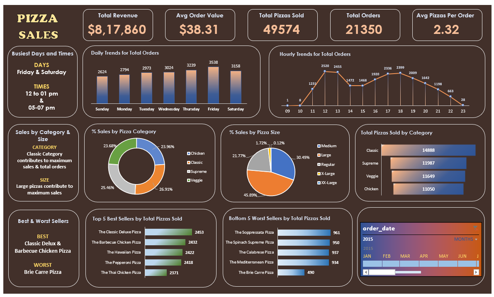

# Excel Sales Dashboard

## Overview
This project is an interactive **Pizza Sales Dashboard** built in Microsoft Excel. 
It provides insights into sales performance, customer ordering trends, and best-selling pizzas through interactive visualizations and KPI cards.

## Tools & Features
- Microsoft Excel
- Pivot Tables
- Pivot Charts
- Slicers
- KPI Cards

## Dashboard Highlights
- Total Revenue
- Total Orders
- Total Pizzas Sold
- Average Order Value
- Average Pizzas per Order
- Daily & Monthly Sales Trends
- Sales by Pizza Category
- Sales by Pizza Size
- Top & Bottom Performing Pizzas

## Files Included
- SalesDashboard.xlsx – Interactive Excel dashboard
- Dataset.csv - Dataset used for analysis
- Sales SQL Queries.docx - SQL queries used for data analysis
- Sales Dashboard.png – Dashboard screenshot
- README.md – Project documentation

## Dashboard Preview

## Skills Demonstrated
- Data Analysis
- Data Visualization
- Dashboard Design
- KPI Reporting
- Business Insights
- Excel Reporting
